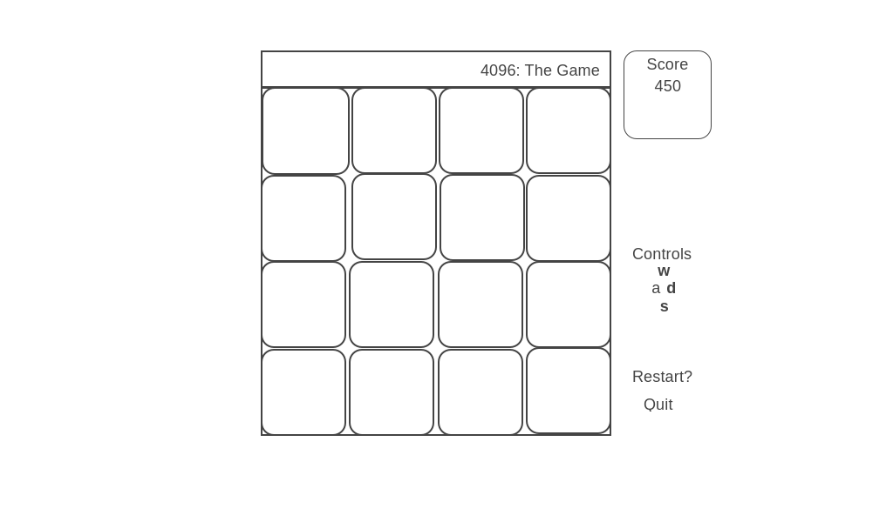

# 4096
# Overview

4096 is an addictive puzzle game based on the populate 2048 slider. To play, use the arrow keys to slide the board pieces and if any numbers align, the pieces will combine and the number value on the combined piece will reflect the sum of the values.  Only pieces with the same number can be combined, i.e. 2 combines with 2 but not 4.

## Functionality
* Users press the arrow keys to slide all the pieces to as far as possible in one direction, either the pieces stop at the wall or the next non matching position
* The game ends when the highest tile reaches 4096 or there are no more available moves

## Wireframe

### Technologies employed
* Vanilla JavaScript
* HTML5 for canvas rendering
* Webpack to bundle scripts into single source

### MVPs
* Basic Visuals and interactive interface
* Player can slide tiles correctly in any direction
* Tiles combine when appropriate and tile values update to the show the correct value
* Point Total is tracked and visible to player

## Development Timeline
### 7/18
* Review and develop board and tile strategy
* Board base setup and styled

### 7/19 
* build game pieces 
* finalize game logic

### 7/20-7/21
* style and make presentable
* web hosting
